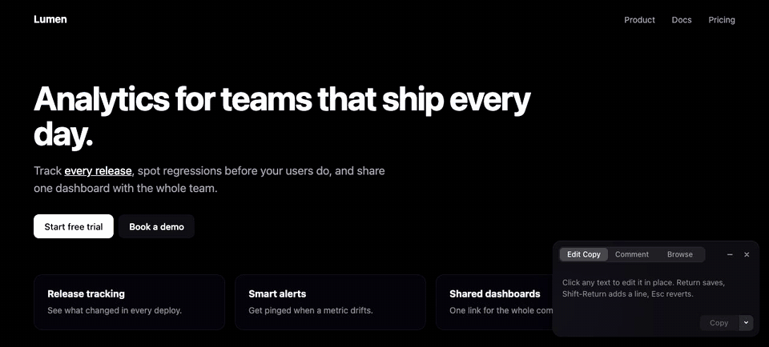

<p align="center"></p>

# Markup

Markup is a Chrome extension that turns edits and comments on any live page into one prompt for your AI agent.

It can also copy them as plain English for Slack. No build step, no account, no server. Your changes stay in your browser until you copy them.

## Install

1. Clone the repo, or download it as a ZIP and unzip it:
   ```bash
   git clone https://github.com/jonnilundy/markup.git
   ```
2. Open `chrome://extensions`.
3. Turn on **Developer mode** (top right).
4. Click **Load unpacked** and pick the `markup` folder (a folder, not a ZIP).
5. Reload any tabs that were already open.

## Usage

Click the Markup icon in the toolbar, or press `Alt+Shift+E`, to turn it on. The panel stays on as you move between pages.

- **Edit Copy**: click any text and type. Your change shows in the list with the old text crossed out.
- **Comment**: click any element and type a note, such as "remove this" or "make this shorter".
- **Browse**: use the page as normal while the panel stays open.
- **Copy**: copies every change from every page. The arrow next to it picks the format:
  - **Copy for Agent**: a detailed prompt with the exact current text, the new text, a CSS selector for each element, and instructions to report what it applied.
  - **Copy for Human**: plain English bullets to paste in Slack.

Copy for Human looks like this:

```text
*Lumen*
https://lumen.example.com/
• Change "Analytics for teams that ship every day." to "Analytics for teams that ship."
• On the link "Book a demo": Remove this, we only want one CTA
```

Drag the panel by its top bar, or flick it, to move it to any corner. It remembers the corner. The minimize button turns it into a small pill. The **×** button clears every change (it asks first) and turns Markup off.

| Key | Action |
| --- | --- |
| `Alt+Shift+E` | Turn Markup on or off |
| `Enter` | Save an edit or a comment |
| `Shift+Enter` | New line in an edit |
| `Esc` | Undo the current edit, or cancel a comment |
| `↑` | Select the parent element in Comment mode |

## Privacy

Markup asks for one permission, `storage`. It runs on every page so the panel can open anywhere, but it does nothing until you turn it on. Your changes are saved in `chrome.storage.local` on your machine. Nothing is sent anywhere. The only way data leaves the browser is when you click Copy and paste it yourself.

## Contributing

There is nothing to build. Edit the files and click reload on the extension card in `chrome://extensions`.

- `content.js`: the panel, the page overlays, and both copy formats
- `background.js`: the toolbar button and the keyboard shortcut
- `test/harness.html`: a demo page with a stand-in for `chrome.storage`, so you can try the panel by opening the file directly, without installing the extension

## License

MIT. See [LICENSE](LICENSE).
